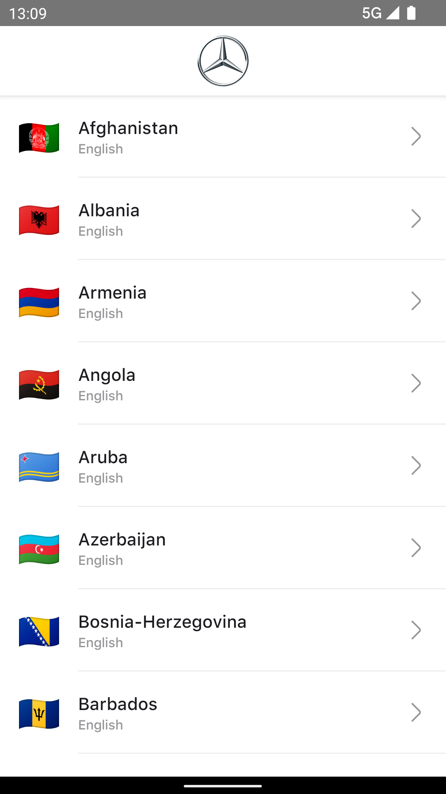
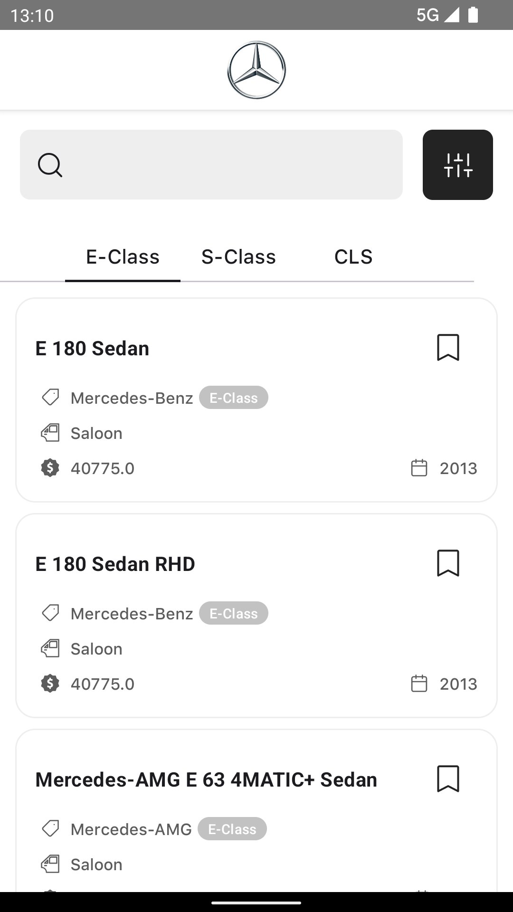
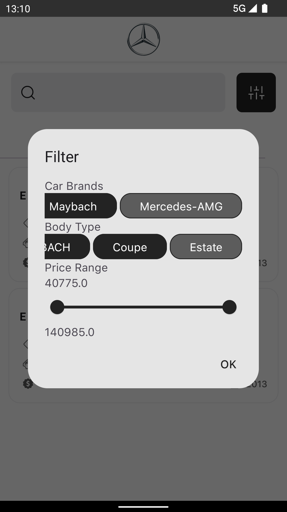

# MercedesBenzCodeChallenge - Car Configurator 

This repository contains a MVP mobile application that provides users with a digital car show case. The application allows users to access the latest car model releases, select a specific market, and browse through a collection of models. Users can conveniently navigate and filter the models based on vehicle class, brand name, body type, and price range.

## User Story

As a user named David, I want to access a digital car configurator on the go. The following are the key features I am looking for:

- Select a specific market to determine the collection of models to be presented.
- Categorize the retrieved models based on vehicle class for easy navigation.
- Filter the models by brand name, body type, and price range for personalized browsing.
- Examine the initial settings of a specific model, including images and other relevant information.
- Mark a model as a favorite for quick access in the future.
- Offline access to at least my favorite models, allowing me to view the information even in areas with limited connectivity.

## Technical Information

The application is built using the following technologies and libraries:

- **Hilt**: Dependency injection framework for managing dependencies.
- **Clean MVVM architecture**: A design pattern that separates the concerns of data, presentation, and interaction.
- **Compose**: A modern UI toolkit for building native UIs.
- **Room**: A database library for offline data storage and retrieval.
- **Retrofit**: A type-safe HTTP client for making API requests.

### The basic flow looks like this :

 

The Repository layer handles data operations. The app's data comes from a few different sources -
data is stored (either remotely or in a local cache for offline use), and the repository modules are
responsible for handling all data operations and abstracting the data sources from the rest of the
app.

The app uses an offline first algorithm. If online data can't be requested, but offline data is
available, use the offline data.

A lightweight domain layer sits between the data layer and the presentation layer and handles
discrete pieces of business logic off the UI thread.

## Screenshots

Here are some screenshots from the application:

| Screenshot 1 | Screenshot 2 | Screenshot 3 |
|--------------|--------------|--------------|
|  |  |  |

## Getting Started

To run the application locally, follow these steps:

1. Clone the repository: `git clone https://github.com/HosseinBakand/MercedesBenzCodeChallenge.git`
2. Open the project in your preferred IDE.
3. Build the project to fetch the dependencies.
4. Run the application on an emulator or a physical device.

---

Thank you for your interest in the Car Configurator application. For any further questions or inquiries, please feel free to contact us.

Best regards,
Hossein Bakand
